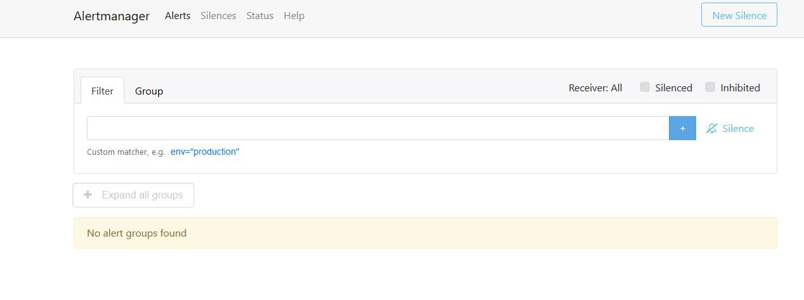

# Couchbase Monitoring"

## Introduction

This project automatically creates two differents VM via Vagrant and Virtualbox.
1. VM couchbase -- This vm launches a CENTOS 7 and install unattended a Couchbase DB and a prometheus exporter
2. VM monitoring -- This vm launches a CENTOS 7 and install unattended {prometheus, alertmanager, grafana }. Furthermore, datasource to connect to prometheus is attached to grafana

The goal is to launch a complete playground of Couchbase in order developers could test their code and check the performance in real time.

## Software needed

This is the list of software you will need to install:
* [Vagrant] (https://www.vagrantup.com/)
* Vagrant Plugins:
  * vagrant-host-manager (used to auto update your hosts/resolve name) 

  ```
  vagrant plugin install vagrant-hostmanager
  ```

  * vagrant-vguest (add more functionalities to vm)  
  ```
  vagrant plugin install vagrant-vbguest
  ```
        
* [Virtualbox] (https://www.virtualbox.org/)


## Start environment

In order to make this project run you will have to run:

1. Clone the project in a folder
```
git clone https://github.com/bonkilla/Couchbase_Monitoring.git
```
2.  Start the first VM (Couchbase)
```
vagrant up centos7_couchbase
```
After the machine is up & running you can access to the couchbase console via:  http://localhost:8091. Please set Administrator as user and password because as this is how it is configured in the couchbase exporter


3. Start the second VM (Prometheus)
```
vagrant up centos7_prometheus
```
4. After the machine is up & running you can access to the grafana webui via: http://localhost:3000.


5. You will have to import the dashboard (grafana_dash_couch.json) as there was no way to it though the api
6. Basic alerting is copied to alertmanager *prometheus_couchbase.yml*
7. Finally you access to Prometheus and Alertmanager in the same way you did to Grafana, via your localhost
    * http://localhost:9090


    * http://localhost:9093




## Stop environment
We have to stop both VM created previously
1. ```
    vagrant halt centos7_couchbase
    ```
2. ```
    vagrant halt centos7_couchbase
    ```

## Delete environment
We have to delete both VM created previously
1. ```
    vagrant destroy centos7_couchbase
    ```
2. ```
    vagrant destroy centos7_couchbase
    ```

## Development Information

The enviroment set-up was:
* VSCode
* VSCode Plugins
    * code --install-extension bbenoist.vagrant
    * code --install-extension yzhang.markdown-all-in-one


## Author information

[David Martinez ](https://pages.github.com/https://github.com/bonkilla)

